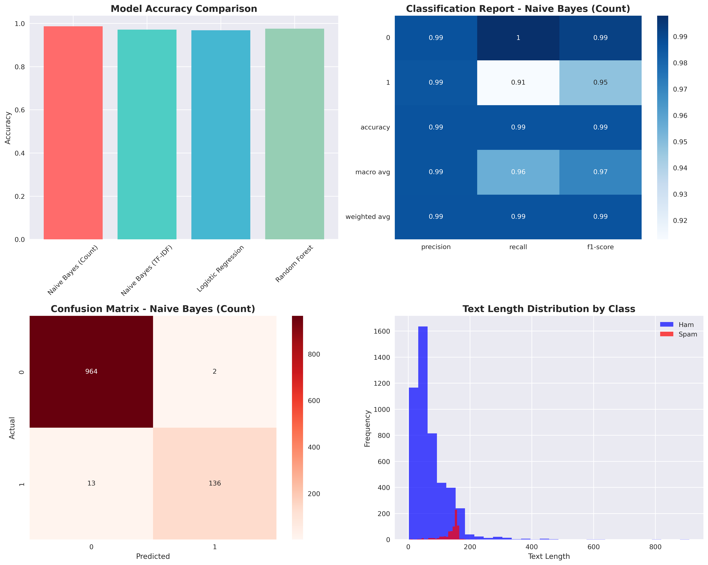
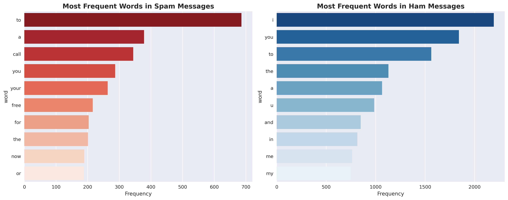

# Advanced Spam Detection Pipeline

This project implements and compares several machine learning models for spam detection. It goes beyond a simple Bag of Words model to include advanced feature engineering, multiple vectorization techniques, and a comparative analysis of different classifiers. The results are visualized to provide clear insights into model performance and data characteristics.

## Features

- **Text Preprocessing**: Cleans messages by removing special characters and converting to lowercase.
- **Feature Engineering**: Creates new features like message length and word count to improve model accuracy.
- **Multiple Vectorization Techniques**:
  - `CountVectorizer` (Bag of Words) with n-grams (unigrams and bigrams).
  - `TfidfVectorizer` with n-grams.
- **Multiple Classification Models**:
  - Multinomial Naive Bayes
  - Logistic Regression
  - Random Forest
- **Comprehensive Evaluation**: Compares models based on accuracy, precision, recall, and F1-score.
- **Rich Visualizations**: Generates and saves plots for:
  - Model accuracy comparison.
  - Per-class performance metrics (precision, recall, f1-score) via heatmap.
  - Confusion matrix for the best-performing model.
  - Text length distribution for spam vs. ham.
  - Most frequent words in spam vs. ham messages.

## Dataset

The project uses the `spam.csv` dataset, which should contain 'Category' (spam/ham) and 'Message' columns.

## Setup

1.  Clone the repository.
2.  Install the required dependencies:
    ```bash
    pip install pandas scikit-learn matplotlib seaborn
    ```

## Usage

Run the main script to train the models, evaluate them, and generate visualizations:

```bash
python "github projects/Bag-of-words spam classification/spam_detection.py"
```

The script will print classification reports to the console and save two PNG files with visualizations in the project directory.

## Results

### Model Performance

Here is a summary of the performance for each model on the test set. The `Naive Bayes (Count)` model achieved the highest accuracy.

**Naive Bayes (Count)**
```
Accuracy: 0.9865
              precision    recall  f1-score   support

           0       0.99      1.00      0.99       966
           1       0.99      0.91      0.95       149

    accuracy                           0.99      1115
   macro avg       0.99      0.96      0.97      1115
weighted avg       0.99      0.99      0.99      1115
```

**Naive Bayes (TF-IDF)**
```
Accuracy: 0.9713
              precision    recall  f1-score   support

           0       0.97      1.00      0.98       966
           1       1.00      0.79      0.88       149

    accuracy                           0.97      1115
   macro avg       0.98      0.89      0.93      1115
weighted avg       0.97      0.97      0.97      1115
```

**Logistic Regression**
```
Accuracy: 0.9686
              precision    recall  f1-score   support

           0       0.97      1.00      0.98       966
           1       1.00      0.77      0.87       149

    accuracy                           0.97      1115
   macro avg       0.98      0.88      0.92      1115
weighted avg       0.97      0.97      0.97      1115
```

**Random Forest**
```
Accuracy: 0.9758
              precision    recall  f1-score   support

           0       0.97      1.00      0.99       966
           1       1.00      0.82      0.90       149

    accuracy                           0.98      1115
   macro avg       0.99      0.91      0.94      1115
weighted avg       0.98      0.98      0.97      1115
```

### Visualizations

The script generates the following visualizations to provide deeper insights.

**1. Performance and Data Analysis**
This plot provides a comprehensive overview of model accuracies, the best model's performance metrics, its confusion matrix, and the distribution of text lengths.



**2. Word Frequency Analysis**
These bar charts show the most common words found in spam and ham messages, highlighting the key terms that distinguish the two classes.




## What I Learned

- **Model Comparison**: This project highlighted that while all models perform well, Naive Bayes with CountVectorizer achieved the highest accuracy. This shows that simpler models can sometimes outperform more complex ones like Random Forest for certain text classification tasks.
- **Feature Importance**: Visualizing word frequencies and text length distributions provided clear insights into the features that distinguish spam from ham.
- **Vectorization Impact**: Comparing CountVectorizer and TfidfVectorizer showed how different text representation methods can influence model performance.
- **End-to-End Pipeline**: Building a pipeline that includes preprocessing, training multiple models, and generating visualizations is a standard practice for robust ML projects.

## License

MIT